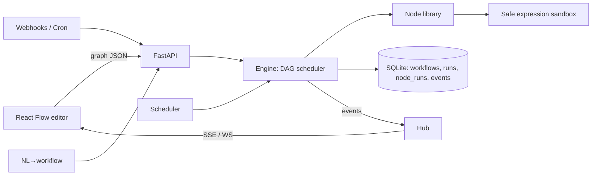

# FlowForge — Visual Workflow Automation Engine  (ALG-AUTO-01)

A **real** workflow engine: users build graphs of triggers → actions → conditions → transforms; FlowForge executes them
with correct data passing, parallel branches, retries, live logs and crash-safe resume. This repo is the backend
(REST + SSE/WebSocket); the node catalog endpoint (`GET /nodes`) is designed to drive a React Flow editor directly.

## Mapping to the problem statement
| Must have | Where |
|---|---|
| Visual workflow editor (backend contract) | React-Flow-compatible graph JSON, `GET /nodes` palette + config schemas, auto-layout, `POST /validate`, `POST /nodes/test` |
| Triggers | manual, **webhook** (secret URL, idempotency keys), **cron / every-N-seconds** scheduler |
| Actions | HTTP (SSRF-guarded), Email (SMTP or outbox), Data Store, Log, Delay, **AI step (Claude)**, **Sub-workflow** |
| Conditions | If/Else, Switch (multi-way) – untaken branches are skipped, merge handles partial arrival |
| Data transformation | Set, Map, Filter, Aggregate, JSON; sandboxed expression language `{{ nodes.x.output.y }}` |
| Actual execution | Async DAG scheduler, bounded parallelism, per-node timeouts |
| Status / logs | Per-node status + input/output persisted; live **SSE** and **WebSocket** events; waterfall `/runs/{id}/timeline` |
| Save / load | SQLite, versioned workflows, run keeps graph snapshot, import/export JSON |

**Innovation / bonus (all implemented):** reusable workflows (sub-workflow + `for_each` fan-out), retries with exponential backoff + jitter,
scheduling, webhooks, parallel branches + merge, **natural-language → workflow** (Claude with validator-driven self-repair; offline rule-based fallback).
**Extras:** error-route edges (`sourceHandle: "error"`), **resume from failure** (re-run reusing successful nodes, no repeated side-effects),
**dry-run** mode (no emails/writes/non-GET calls), idempotent triggers, run replay, cancel, single-node test.

## Architecture

**Execution model.** Every edge is *unresolved → active/inactive*. A node becomes ready when all incoming edges are resolved; it runs if ≥1 is active,
otherwise it is skipped and inactivity propagates. This gives correct if/else, switch, merge and error-route semantics with real parallelism and no special cases.

## Run
```bash
pip install -r requirements.txt
FLOWFORGE_ALLOW_PRIVATE=1 uvicorn flowforge.api:app --port 8000     # docs: http://localhost:8000/docs
./demo.sh                                                            # 90-second scripted demo
python -m unittest discover -s tests -t . -v                              # 21 tests, stdlib only (engine + API handler logic)
```

## Graph format (React Flow compatible)
```json
{"nodes":[{"id":"n1","type":"trigger.webhook","position":{"x":0,"y":0},"data":{"label":"Hook","config":{},"settings":{"retries":2,"backoff":0.5,"timeout":30}}}],
 "edges":[{"source":"n1","target":"n2","sourceHandle":"true"}]}
```
Expression scope: `trigger`, `input` (upstream output), `inputs`, `nodes.<id|label_slug>.output`, `vars`, `run`.

## Security
Expressions run in an AST whitelist (no eval, no dunders, step/size budgets). HTTP node blocks private/loopback/link-local targets and redirects unless `FLOWFORGE_ALLOW_PRIVATE=1`.
Webhook URLs carry a 24-byte secret (constant-time compare); optional global `FLOWFORGE_API_KEY`; sensitive headers stripped from webhook payloads; 1 MB payload/output caps; sub-workflow depth cap.

## Known limitations / future work
Single-process engine (SQLite; swap for Postgres + a queue to scale out; scheduler is already idempotent per slot). Loops are expressed via sub-workflow `for_each`, not cyclic graphs.
DNS-rebinding is not fully mitigated in the SSRF guard. No per-user auth/RBAC beyond the API key.

## Disclosure (AI-assisted components)
Code was written with AI assistance (Claude). Runtime AI is optional: the `AI Step` node and LLM-based workflow generation call the Anthropic API only if `ANTHROPIC_API_KEY` is set; otherwise stubs / rule-based fallback are used.
No external datasets.
